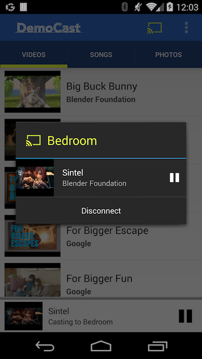
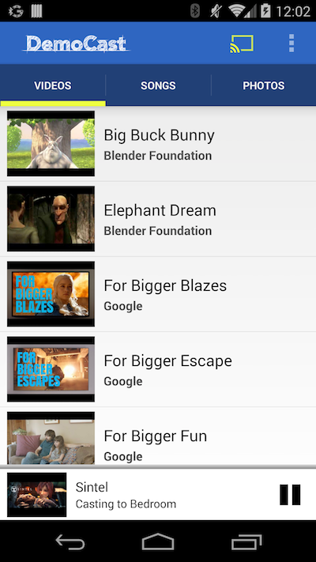
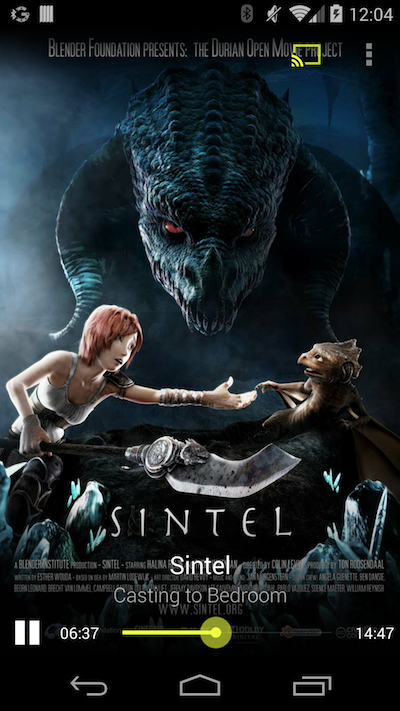

# Cast Companion Library for Android

- [Introduction](#introduction)
- [Overall Design](#overall-design)
  - [Dependencies and Project Setup](#dependencies-and-project-setup)
- [How to Use the Cast Companion Library](#how-to-use-the-cast-companion-library)
  - [Initializing VideoCastManager](#initializing-videocastmanager)
  - [Adding a Cast Button to the Action Bar/Toolbar](#adding-a-cast-button-to-the-action-bartoolbar)
  - [Adding a MediaRouteButton](#adding-a-mediaroutebutton)
  - [Adding a Mini-Controller](#adding-a-mini-controller)
  - [Notifications](#notifications)
  - [Lock Screen Controllers and Volume](#lock-screen-controllers-and-volume)
  - [Cast Player Screen](#cast-player-screen)
    - [Volume Control](#volume-control)
  - [Session Recovery (Reconnection)](#session-recovery-reconnection)
  - [Handling Tracks and Closed Captions](#handling-tracks-and-closed-captions)
    - [API Support](#api-support)
    - [Changing the Style for Text Tracks](#changing-the-style-for-text-tracks)
    - [Setting Active Tracks from UI](#setting-active-tracks-from-ui)
  - [Queues](#queues)
  - [Single Custom Data Channel](#single-custom-data-channel)
- [Support for data-centric applications](#support-for-data-centric-applications)
- [Hooking into Lifecycle Callbacks](#hooking-into-lifecycle-callbacks)
- [Advanced Topics](#advanced-topics)
  - [Live Streams](#live-streams)
    - [Reconnection](#reconnection)
  - [Obtaining Authorization prior to playback](#obtaining-authorization-prior-to-playback)
  - [Supporting Configuration Changes in VideoCastControllerActivity](#supporting-configuration-changes-in-videocastcontrolleractivity)
- [Configuration and Setup](#configuration-and-setup)
  - [Manifest file](#manifest-file)
  - [Configurable Messages](#configurable-messages)

## Introduction

This document describes the Cast Companion Library for Android (CCL). Throughout
the document, there may be references to the
[Cast Video application](https://github.com/googlecast/CastVideos-android) that
is built using CCL to show how the library can be used in a practical example.

CCL is written with the following objectives in mind:
- To provide a wrapper around the Cast SDK and related Google Play Services to
hide the mundane tasks that are needed for casting.
- To provide a collection of ready-to-use Cast-related components and features
that are strongly recommended by the
[UX Guidelines](https://developers.google.com/cast/docs/ux_guidelines).
- To provide an example of how the Cast SDK can be used to accomplish more
complex tasks.

Since playing media is a common use case on a Chromecast device, CCL provides
extensive support for casting and managing media content. In addition, it
supports applications that strictly use custom data channels.

Features that CCL provides for media-centric applications:
- Wrapper for device discovery
- Customized notification
- Customized Cast Menu (Media Router controller dialog)
- Lock Screen remote control via `MediaSessionCompat` and
`NotificationCompat.MediaStyle`
- Player Control while casting
- Global access via Mini-Controller
- Pain-free session recovery, including the reconnection logic outlined in the
UX guidelines
- A single custom data channel for sending and receiving custom data
- Ability to check the installed Google Play services for compatibility
- Handling media tracks, including settings page for all versions of Android
- Handling changes to the volume of the cast device using the hard volume
buttons inside and outside of the app, even on the lock screen or when the
screen is off

Features that CCL provides for data-centric applications:
- Wrapper for device discovery
- Wrappers for registering and using multiple custom data channels
- Pain-free session recovery
- Ability to check the installed Google Play services for compatibility

In the subsequent sections, we will describe how each of these features can be
accessed by an application. We will use "client" to refer to an application that
uses CCL.

## Overall Design

Most of this document focuses on media-centric applications. Toward the end, we
discuss how data-centric applications can use this library.

To maintain the state of the application regarding connectivity to a Cast
device, there needs to be a central entity that transcends the lifecycles of
individual activities in the application. The CCL’s main component, the
`VideoCastManager` is the entity that does that. (`DataCastManager` is a similar
component for data-centric use cases.)

This class is responsible for managing most of the work by:
- Providing a rich set of APIs and callbacks.
- Maintaining the state of the system, such as:
  - Connectivity to the Cast device
  - Status of the media on the receiver
- Updating various components, such as:
  - The CCL Notification Service
  - The Mini-Controller

In order to have a notification that persists when the client application is
killed, CCL starts a Cast Notification Service.

The [Cast UX guidelines](https://developers.google.com/cast/docs/ux_guidelines)
request that the system notification for a Cast application be visible only when
the application is not visible. By providing simple hooks for the client,
CCL handles this task as well.

Here is a subset of classes and their main responsibilities, discussed in more
detail in subsequent sections:

- `BaseCastManager`
  - An abstract class that handles most of the connectivity to a cast device,
  including the reconnection logic.
  - Clients are encouraged to use the two concrete subclasses `VideoCastManager`
  and `DataCastManager`, but if they need to modify the behavior, they can
  extend these two concrete classes or implement this abstract class directly.

- `VideoCastManager`
  - Designed specifically for video-centric applications, this is a singleton
  that clients interact with directly. Internally, it uses other classes and
  components of CCL to manage the state of a video-centric application.

- `VideoCastNotificationService`
  - A local service that allows notifications to appear beyond the availability
  of the main application.

- `MiniController`
  - A compound control that provides a Mini-Controller for the client.

- `VideoCastControllerActivity`
  - Provides a default implementation of the Player Control screen that clients
  can use with their application. Most of the associated logic is defined in the
  `VideoCastControllerFragment`.

- `DataCastManager`
  - Another concrete subclass of the `BaseCastManager`.
  - Designed specifically for data-centeric applications, this is a singleton
  that clients interact with directly. Internally, it uses other classes and
  components of CCL to manage the state of a data-centric application.
  - Provides means to register one or more namespaces for data communication
  between a sender client and a receiver application.

- `ReconnectionService`
  - A background service that handles reconnection logic when wifi connectivity
  is lost.

The MediaRouter and Cast SDK, in collaboration with Google Play Services,
provide a collection of asynchronous calls that assist in, for example,

- the discovery method,
- route selection,
- device connection,
- and `RemoteMediaPlayer` creation.

For each of these asynchronous calls, there are one or more callbacks that
inform the caller of the success or failure of the API calls. They are
generally a signal that it is safe to move to the next call. Not all the
activities or components in a client app are interested in receiving every
callback. CCL makes it easy for client components to register for a subset of
callbacks based on their needs. Although most of the Cast API calls are made by
CCL, clients can choose to be notified of all relevant events and callbacks.

### Dependencies and Project Setup

List of dependencies:
- android-support-v7-appcompat
- android-support-v7-mediarouter
- Google Play Services (the Base and Cast components)

_**Note:** Make sure you use the v7 support version of the MediaRouter
library and not the one that is included in the Android framework._

Since the two support libraries contribute resources as well, you cannot simply
satisfy the dependency by including their jar files; instead, you must import
them as library projects in Eclipse or in AAR packaged format in Android Studio.
See the
[Support Library Setup](http://developer.android.com/tools/support-library/setup.html)
for how to do this.

Your client project only needs to list CCL as its dependency for Cast-related
functionality. In other words, your client application does not need to
directly import or declare a dependency on the support libraries mentioned
above, since CCL brings those dependencies along.

Since Cast APIs are mainly provided by Google Play Services, the CCL library
provides a convenient static method that all client applications should call at
startup to verify that a compatible version of the Google Play Services is
available on the device. If Google Play Services is missing or needs to be
updated, a dialog will inform user and direct her to go to the Play Store to
download/update the appropriate version. If Google Play Services is installed
but not enabled, it will direct her to the device settings page to enable it.

To enable this important validation check, here is sample code to call this
functionality in the `onCreate()` of the launcher Activity of your application:

```java
@Override
protected void onCreate(Bundle savedInstanceState) {
	super.onCreate(savedInstanceState);
	BaseCastManager.checkGooglePlayServices(this);
	.....
}
```

## How to Use the Cast Companion Library

For this example, we will mainly focus on video-centric applications and use the
`VideoCastManager`, but in many cases the instructions apply to the
`DataCastManager` as well.

### Initializing `VideoCastManager`

The client application needs to instantiate and initialize an instance of
`VideoCastManager` as early as possible. During the initialization step, the
client should provide certain information to CCL. We recommend you do this step
in the `onCreate()` method of you Application class, so it can easily access it
in all activities of your application.

The following snippet shows how the
[CastVideos-android](https://github.com/googlecast/CastVideos-android)
reference application does that:

```java
public void onCreate() {
	super.onCreate();
	VideoCastManager
		.initialize(this, APPLICATION_ID, null, null)
		.enableFeatures(VideoCastManager.FEATURE_NOTIFICATION |
				VideoCastManager.FEATURE_LOCKSCREEN |
				VideoCastManager.FEATURE_WIFI_RECONNECT |
				VideoCastManager.FEATURE_AUTO_RECONNECT |
				VideoCastManager.FEATURE_CAPTIONS_PREFERENCE |
				VideoCastManager.FEATURE_DEBUGGING);
}
```

The static `VideoCastManager.initialize()` method takes four arguments:

1. An (application) Context object

2. An application ID

3. An activity that provides the "Player Control" functionality. If you want CCL
to provide its default Player Control page, make this `null`.

4. A namespace for a custom data channel. Leave this as `null` if no custom data
channel is required. See the section on
[data channels](#single-custom-data-channel) later in this document to see how
this can be used.

_**Note:** `initialize()` will log an error message if it detects that an
incompatible version of Google Play Service is installed, missing, or not
activated._

CCL has a number of features that are disabled by default. Immediately after the
initialization, clients should inform the `VideoCastManager` what features they
want to enable by calling the static `enableFeatures` method.

Currently there are six features that can be turned on:

1. Notifications
2. Lock Screen remote controller
3. Closed Captions
4. WIFI Reconnection
5. Auto Reconnection
6. Logging in the Google Play Services

To specify which features should be enabled, construct an OR-ed expression of
the desired features and pass that to the `enableFeatures` method (as shown in
the snippet above). Note that all features are disabled by default.

After this initialization, you can access this singleton instance by calling:

```java
mCastManager = VideoCastManager.getInstance();
```

_**Remark:** In performing certain tasks, CCL needs to have a reference to the
Application Context instance from the client application. Any action that
requires an Activity Context will ask for one from the client in its API call._

### Adding a Cast Button to the Action Bar/Toolbar

After setting up the `VideoCastManager`, the next step is to put the Cast button
in the Action Bar or Toolbar. We assume that your activity is a direct or
indirect subclass of `AppCompatActivity`, from the appcompat-v7 library (if your
activity inherits from `FragmentActivity` see the next section for
[adding a `MediaRouteButton`](#adding-a-mediaroutebutton)).

1. Add the following snippet to the xml file that defines your menu:

	```xml
	<item
		android:id="@+id/media_route_menu_item"
		android:title="@string/media_route_menu_title"
		app:actionProviderClass="android.support.v7.app.MediaRouteActionProvider"
		app:showAsAction="always"/>
	```

2. Add the following code to the `onCreateOptionMenu()` in all your activities:

	```java
	@Override
	public boolean onCreateOptionsMenu(Menu menu) {
		super.onCreateOptionsMenu(menu);
		getMenuInflater().inflate(R.menu.main, menu);
		mCastManager.addMediaRouterButton(menu, R.id.media_route_menu_item);
		return true;
	}
	```

	Note that the method `addMediaRouterButton` returns a reference to the
  `MenuItem` that represents the Cast button if you need to access it.

3. In the `onResume()` method of your activity, add the following snippet:

	```java
	mCastManager = VideoCastManager.getInstance();
	mCastManager.incrementUiCounter();
	```

	and in `onPause()`, add:

	```java
	mCastManager.decrementUiCounter();
	```

Now you have a Cast button in your Action Bar, and the VideoCastManager will be
in charge of all the plumbing needed to provide the appropriate dialogs, etc.

CCL also provides a custom Cast MediaRouter dialog when the client is connected:



### Adding a MediaRouteButton

If your activity inherits (directly or indirectly) from `FragmentActivity`,
you can use a `MediaRouteButton`. Add a snippet like this to your layout:

```xml
<android.support.v7.app.MediaRouteButton
	android:id="@+id/media_route_button"
	android:layout_width="wrap_content"
	android:layout_height="wrap_content"
	android:mediaRouteTypes="user"
	android:visibility="gone" />
```

Then obtain a reference to the button in your activity and use CCL to set it up:

```java
mMediaRouteButton = (MediaRouteButton) findViewById(R.id.media_route_button);
mCastManager.addMediaRouterButton(mMediaRouteButton);
```

To update the visibility, you can hook into a callback in `VideoCastManager`:

```java
mVideoCastConsumer = new VideoCastConsumerImpl() {
	.....
	@Override
	public void onCastAvailabilityChanged(boolean castPresent) {
		mMediaRouteButton.setVisibility(castPresent ? View.VISIBLE : View.INVISIBLE);
	}
	.....
};
```

Like in the previous section, make sure you call `incrementUiCounter()` and
`decrementUiCounter()` in the `onResume()` and `onPause()` methods of your
activity, respectively. Also, you need to obtain and set the initial state of
the button when you enter an activity (the above callback will help you maintain
the correct state when there is a change, but the initial state must be set
first). Use the following snippet to set the initial state:

```java
mMediaRouteButton.setVisibility(mVideoCasrManager.isRouteAvailable() ? View.VISIBLE : View.INVISIBLE);
```

### Adding a Mini-Controller



The Mini-Controller is a small, persistent component that enables users to:

- quickly see the content that is playing on the Cast device,
- perform basic operations on the remote media (such as play/pause),
- and get back to the Cast Player page (by clicking on album art).

It also provides an extended component to show the "upcoming" item if you have a
queue with auto-play turned on. The Mini-Controller should be visible **if and
only if** remote media is playing. For audio-only content such as music, you
might need to have to component available for local playback.

CCL provides a component for the Mini-Controller that can be added to the layout
XML of your pages. Here is an example:

```xml
<com.google.sample.castcompanionlibrary.widgets.MiniController
	android:id="@+id/miniController"
	android:layout_width="fill_parent"
	android:layout_height="wrap_content"
	android:layout_alignParentBottom="true"
	android:background="@drawable/shadow7"
	app:auto_setup="true"
	android:visibility="gone">
</com.google.sample.castcompanionlibrary.widgets.MiniController>
```

To configure this component, you have two choices:

1. Using `auto_setup="true"`. If you set this xml attribute to `true`, no
additional work is required.  This is the preferred approach.

2. Manual configuration. If you set `auto_setup="false"` (this is the default
value for this attribute), the client application needs to register this
component so that the library can manage its visibility, state, and content.
Additionally, the client application is responsible for unregistering this
component when it is not needed. To register this component with the
`VideoCastManager`, add the following to your activity's `onCreate()` method:

	```java
	mMiniController = (MiniController) findViewById(R.id.miniController);
	mCastManager.addMiniController(mMiniController);
	```

	Remember to unregister this component when you are done by adding the
	following line to the `onDestroy()` method:

	```java
	mCastManager.removeMiniController(mMiniController);
	```

Whether you use the `auto_setup` feature or manually register this component,
the `VideoCastManager` handles:
- updating the metadata shown in this component,
- the status of the play/pause button,
- and the visibility of the whole control (e.g. if you disconnect your client
application from the Cast device, it will hide this component).

Note that the play/pause/stop buttons are drawables that are defined as aliases
to the real assets, so you can easily customize them in your application if
needed. These aliases can be found in the res/drawable directory of the CCL and
are named `ic_mini_controller_pause`, etc.). You can copy these aliases to your
application and change what they point to.

When you are playing a queue of items and auto-play is on, this component shows
an extended area when an upcoming item starts preloading on the receiver. This
extended area is used to both inform the user of the upcoming item and to let
the user control the auto-play behavior by providing a "play" button (which, if
clicked, will start playing the upcoming item immediately) and a "stop" button
(to stop the app from proceeding to the next item; in this case, the playback of
the current item will not be changed).

## Notifications

Notifications will be managed for you if you enabled that feature for the
`VideoCastManager`. The flag to do that is
`VideoCastManager.FEATURE_NOTIFICATION`. You need to help CCL discover when the
client application is visible (to hide the notification) and when it is in the
background (to show the notification). This can be accomplished by adding the
following line to your `onResume()` method:

```java
mCastManager.incrementUiCounter();
```

and the following line to the `onPause()` method of all your activities:

```java
mCastManager.decrementUiCounter();
```

Note that these lines were also required for adding `MediaRoute` discovery, so
your activities should already have them. CCL also handles notifications on
different versions of Android and uses the `NotificationCompat.MediaStyle`
internally.

### Lock Screen Controllers and Volume

CCL can provide default lock screen controllers based on the combination of
`NotificationCompat.MediaStyle` and `MediaSessionCompat`. This feature needs to
be enabled soon after the initialization of `VideoCastManager` by using the flag
`VideoCastManager.FEATURE_LOCKSCREEN`.

When this feature is enabled, a Play/Pause button will be shown on the lock
screen of Android devices running Jelly Bean+. On KitKat+ devices, the layout of
the lock screen controllers is different and uses full-screen album art, while
on Jelly Bean it uses a small version of the album art. CCL also makes sure that
on Lollipop+, the appropriate Lock Screen controllers are added (based on
`NotificationCompat.MediaStyle`).

CCL also provides the ability for users to control the system volume of the Cast
device even if the application is in the background. On KitKat+ devices, this
works even if the screen is off.

### Cast Player Screen



If you opted for the default Cast Player screen during the initialization of
`VideoCastManager`, you will get this screen without any additional effort.

The Cast Player page shows full screen artwork with some additional metadata
and controls to manage playback. It is important to provide a large image for
your media for the best user experience.

If the user clicks on the artwork in the Mini-Controller or notification, a
transition to the Cast Player page will happen automatically. If you want to
start casting from within the client application, the Cast Manager provides a
simple mechanism for you to launch that screen:

```java
mCastManager.startCastControllerActivity(context, mSelectedMedia, position, autoPlay);
```

Here, `mSelectedMedia` is a `MediaInfo` object that represents the media you
want to cast, `position` (integer) is the starting point of the video, and
`autoPlay` (boolean) signals whether or not you want to automatically start
playback of the media.

This component can handle queues and also provides controls for navigating
through queue items.

_**Remark 1:** To have all the metadata for a movie available when needed, you
need to build and populate an instance of
[`MediaInfo`](https://developers.google.com/android/reference/com/google/android/gms/cast/MediaInfo)
to represent the video. The fields are:_

- metadata: use an instance of MovieMetadata that is populated with:
  - title
  - sub-title
  - studio
  - images
    - index 0: small image, for the notification, minicontroller, and lock
    screen on JellyBean
    - index 1: large image, for the Cast Player page and lock screen on KitKat
contentId (populate this with the URL pointing to the media)
- contentType: e.g. "video/mp4"
- streamType: typically of type `MediaInfo.STREAM_TYPE_BUFFERED`
- MediaTracks: Closed caption and tracks information. See the section on
[Handling Tracks and Closed Captions](#handling-tracks-and-closed-captions).

_**Remark 2:** It is very tempting to try to pass around MediaInfo objects
between activities. For example, if the user is browsing a catalog and selects a
video, you might want to pass the MediaInfo that represents that video to the
next activity. Unfortunately, MediaInfo is neither `Serializable` nor
`Parcelable` so you cannot pass that in an intent; however, CCL uses a simple
`Bundle` to wrap the `MediaInfo`, and provides two static utility methods
`Utils.bundleToMediaInfo()` and `Utils.mediaInfoToBundle()` to convert between
the two types:_

```java
public static Bundle mediaInfoToBundle(MediaInfo info);
public static MediaInfo bundleToMediaInfo(Bundle wrapper);
```

#### Volume Control

CCL provides an easy way for developers to control volume in their applications.

Inside an activity, you can override `dispatchKeyEvent()`:

```java
@Override
public boolean dispatchKeyEvent(KeyEvent event) {
	return mCastManager.onDispatchVolumeKeyEvent(event, VOLUME_INCREMENT)
			|| super.dispatchKeyEvent(event);
}
```

CCL will handle the rest, i.e. it enables controlling the cast volume through
the hard volume buttons on the phone and shows a visual volume bar on supported
versions. If `FEATURE_LOCKSCREEN` was enabled during the initialization of the
`VideoCastManager`, CCL handles changing volume through the hard volume buttons
if your app is not in the foreground, if the device is locked, or even if the
screen is off. In the above snippet, `VOLUME_INCREMENT` is a value you set in
your application that you need to tell CCL about by calling the following at an
early stage, preferably at the initialization time:

```java
mCastManager.setVolumeStep(VOLUME_INCREMENT);
```

The recommended value for `VOLUME_INCREMENT` is 0.05 when targeting a TV and
0.03 when targeting an audio-only device.

_**Remark 3:** If you are targeting Android versions ICS and above, you do not
need to override the `dispatchKeyEvent` at all; `MediaSessionCompat` will handle
this automatically. If you need to support GingerBread, this change is required
and only works when you app is in the foreground._

## Session Recovery (Reconnection)

To provide a seamless user experience, we need to handle the following scenario:

Assume that a client application is connected to a Cast device. If the user
closes the application without calling an explicit disconnect, then later opens
the same application, the client application needs to try to re-establish the
connection to the same device as long as the Cast device is still running the
same session that the user had started/joined earlier. If the system has not yet
killed your application, this does not require any effort. However, if your
application has been killed by the system (or connectivity was lost because,
e.g., the user stepped outside of wifi range), some work needs to be done.

CCL can handle both of these cases with no effort on the application side. To
enable the automatic session recovery when your app comes to the foreground,
turn the `VideoCastManager.FEATURE_AUTO_RECONNECT` feature on after initializing
the `VideoCastManager`. CCL handles the rest. If you want to trigger the
reconnection attempt manually, you can call the following method:

```java
mCastManager.reconnectSessionIfPossible(timeoutInSeconds);
```

This method makes a best-effort attempt to reconnect to the same device if the
same session is still running. The optional (int) `timeoutInSeconds` limits how
long (in seconds) the reconnection effort should last. If the parameter is not
present, a 10 second timeout is used. If the client is unable to establish a
connection during the timeout, the effort is abandoned.

There are more subtle, yet important, cases that must be handled. As an example,
the user starts casting a long video and puts down her phone on the table; the
phone goes to sleep and the wifi radio is turned off by the system. After a
while, the user picks up her phone to pause the movie using the lock screen
controls, but since her phone had lost connectivity, she cannot take any
immediate actions. Reconnection logic should handle such scenarios and, as soon
as the wifi connectivity is up again, it should try to connect to the same
session and make the lock screen controls operational.

To handle those and other related cases that are explained in the
[Cast UI Checklist](https://developers.google.com/cast/docs/design_checklist),
CCL manages a long-running service, `ReconnectionService`, that monitors the
wifi connectivity and tries to reconnect if possible. To enable this session
recovery, turn on `VideoCastManager.FEATURE_WIFI_RECONNECT`. If you don’t want
this reconnection to happen in certain situations, you must clear the persisted
data by calling `VideoCastManager.clearPersistedInfo(what)` or
`DataCastManager.clearPersistedInfo(what)`. The argument "what" can be any
combination of values that restrict what portion(s) of the persisted information
should be cleared. See the JavaDoc for more details.

_**Note.** The long running service `ReconnectionService` will only start if the
`VideoCastManager.FEATURE_WIFI_RECONNECT` has been set after the
`VideoCastManager` initialization and only if media playback starts._

### Handling Tracks and Closed Captions

Handling tracks can be divided into three areas: API Support, Changing the
Style, and UI Handling.

#### API Support

The Cast SDK provides a number of APIs that can be used to:
- define tracks,
- associate them with a media (video) object,
- set or update active tracks for a media,
- and set or update the style for a text track. See
[Using the Tracks API](https://developers.google.com/cast/docs/android_sender#tracks)
for more details.

The first step is to define a track. The `MediaTrack` class represents a track,
and you can define a track using the builder pattern:

```java
MediaTrack englishSubtitle = new MediaTrack.Builder(1 /* ID */, MediaTrack.TYPE_TEXT)
		.setName("English Subtitle")
		.setSubtype(MediaTrack.SUBTYPE_SUBTITLE)
		.setContentId("https://some-url/caption_en.vtt")
		.setLanguage("en-US") // optional, but required for subtitle type
		.build();
```

Note that the first argument to the Builder is a unique ID that the application
(not the SDK) defines and assigns to a track so that subsequent API calls can
refer to the it.

The next step is to add one or more tracks to a video. This should happen before
loading the media; any changes made to the tracks after loading the media will
not take effect until the media is reloaded. To do that, include the tracks when
you build your `MediaInfo` object:

```java
MediaInfo mediaInfo = MediaInfo.Builder(url)
		.setStreamType(MediaInfo.STREAM_TYPE_BUFFERED)
		.setContentType(getContentType())
		.setMetadata(getMetadata())
		.setMediaTracks(tracks) /* a list of tracks */
		.build();
```

Then you can load this media and set or update its style. CCL provides the
following wrapper methods:

```java
/* Load a media and set its active tracks */
public void loadMedia(MediaInfo media, final long[] activeTracks,
		boolean autoPlay, int position, JSONObject customData);

/* Sets or updates the active tracks for the currently playing media */
public void setActiveTrackIds(long[] trackIds);

/* Sets or updates the style for the current text track */
public void setTextTrackStyle(TextTrackStyle style);

/* Gets the list of active track ids for the currently playing media */
public long[] getActiveTrackIds();
```

#### Changing the Style for Text Tracks

Users should be able to turn the captions on or off and change the style of
tracks (e.g. changing the size of the font or the color of the background for
captions). In KitKat+, captions can be customized through Captions Settings,
found under Settings -> Accessibility. Earlier versions of Android, however, do
not have this capability. CCL handles this by providing custom settings for
earlier versions and delegating to the system settings on KitKat+. To take
advantage of this feature, you need to enable the support for this feature when
you initialize the `CastVideoManager` using the flag:
`VideoCastManager.FEATURE_CAPTIONS_PREFERENCE`.

Then you can add an entry point into the Captions settings in your own
application preferences. Simply add the following snippet to the XML file that
defines the preferences for your application (remember to replace
`YOUR_APPLICATION_PACKAGE` with your own package name):

```xml
<PreferenceCategory
  android:title="@string/captions_settings">
  <PreferenceScreen
    android:key="CAPTION_KEY"
		android:title="@string/captions">
		<intent android:action="android.intent.action.VIEW"
      android:targetClass="com.google.android.libraries.cast.companionlibrary.cast.tracks.CaptionsPreferenceActivity"
			android:targetPackage="YOUR_APPLICATION_PACKAGE"/>
	</PreferenceScreen>
</PreferenceCategory>
```

You also need to add the following snippet to the `onResume()` method of your
applicaton's `PreferenceActivity`:

```java
mCastManager.updateCaptionSummary("CAPTION_KEY", preferenceScreen);
```

Note that `CAPTION_KEY` in this snippet should match the key in the XML file
above.

Adding these snippets provides an entry in the application’s preferences that
allows users to enable or disable captions and customize the style for all
versions of Android. When the user makes a change in the captions settings, CCL
will be notified automatically and will update the style of caption on the Cast
device. In addition, the `VideoCastConsumer` has three callbacks that
applications can listen to if they are interested in these changes:

```java
public void onTextTrackStyleChanged(TextTrackStyle style);
public void onTextTrackEnabledChanged(boolean isEnabled);
public void onTextTrackLocaleChanged(Locale locale);
```

These parallel the callbacks that are available in Android KitKat+ through the
system framework, but CCL also extends them to the earlier versions.

Note that you need to define a certain activity in your manifest if you want to
enable this feature. See the section on [Manifest](#manifest-file).

#### Setting Active Tracks from UI

Users need a way to view and select the available tracks. This is mainly the
responsibility of the application, but CCL makes it easier by providing a dialog
that shows the available tracks and allows the user to select one or more
tracks. To open this dialog, use the following snippet:

```java
TracksChooserDialog.newInstance(mMediaInfo) .show(mFragmentManager /* e.g. getSupportFragmentManager() */,"some_tag");
```

This dialog allows user to select a Text track or an Audio track. CCL notifies
any components registered to receive such information. To register a component,
implement the interface `OnTracksSelectedListener` and use the following APIs to
start listening:

```java
mCastManager.addTracksSelectedListener(OnTracksSelectedListener);
```

and to stop listening:

```java
mCastManager.removeTracksSelectedListener(OnTracksSelectedListener);
```

The `TracksChooserDialog` dialog extends `FragmentDialog` (from v4 support
library), hence survives screen rotation and other configuration changes.

The Cast Player Screen also provides an icon that opens this dialog and allows
user to select one or more tracks for the media that is playing on the cast
device. Note that tracks support should be enabled in order for this icon to
appear; if the media does not have any tracks, the icon will be grayed out (but
visible) as long as tracks support has been enabled.

### Queues

The Cast SDK provides support for a queue of media items (video or audio).
Client applications should build a queue and then use any of the queue-related
APIs that CCL provides to manage the queue, such as load, update, insert,
delete, shuffle, etc. The receiver SDK creates a queue even if one single item
is loaded using the normal load command (vs `queueLoad()`).

CCL provides a number of callbacks to update clients on changes to the queue,
such as `onMediaQueueUpdated()`. In addition, when you have a queue of video
items with adaptive bitrate (such as a queue of HLS streams), you can take
advantage of "preload" feature which allows you to preload the next video when
the the currently playing item finishes downloading; this allows a much smoother
transition from one queue item to the next.

CCL also provides a number of callbacks to inform the application of the
preloading event, such as `onRemoteMediaPreloadStatusUpdated()`.  See
[`VideoCastConsumer`](https://github.com/googlecast/CastCompanionLibrary-android/blob/master/src/com/google/android/libraries/cast/companionlibrary/cast/callbacks/VideoCastConsumer.java)
for a complete list of available callbacks.

#### Single Custom Data Channel

For media-centric applications, CCL provides a single data channel (in addition
to the standard media channel) to enable out-of-band communication between the
sender and receiver applications. For example, a sender application may need to
provide a mechanism for its users to give a thumbs-up or thumbs-down when they
are watching content. This type of communication requires a custom data channel.

To do this, you can use the last argument to `VideoCastManager.initialize()`.
You can choose a namespace and pass that in as the last argument. CCL will then
set up the sender part of the data channel and provide a single API for you to
send a message to the receiver (`sendDataMessage()`) and two callbacks:

1. `onDataMessageReceived()` - called when the receiver receives a message
2. `onDataMessageSendFailed()` - called if the send command encounters an error

CCL also provides an API for you to remove your custom data channel
(`removeDataChannel()`), but does the appropriate clean up for you when you
disconnect from a device. Refer to the library's JavaDoc for documentation on
these APIs and callbacks. Note that you need a custom receiver to send and
receive messages using your custom namespace.

## Support for data-centric applications

If you are working with an application that is mainly data-centric and needs one
or more custom data channels but no media data channel, you can initialize and
use a different class in the library, the `DataCastManager`. This class is
equivalent to the `VideoCastManager` and behaves similarly when you are setting
it up.

To initialize this class, call the following method:

```java
initialize(Context context, String applicationId, String... namespaces);
```

As is clear from the above snippet, you can register one or more namespaces by
appending them as the last arguments of this method. Note that you can
add/remove namespaces later on by calling:

```java
addNamespace(String namespace); // to add a new namespace
removeNamespace(String namespace); // to remove
```

The library takes care of setting up the data channel(s) for you. You can then
use the following API to send a message on any of these channel(s):

```java
void sendDataMessage(String message, String namespace);
```

This will send a message. Messages that are sent to the sender from the receiver
can be captured by extending the `DataCastConsumerImpl` class and overriding the
following callbacks:

```java
public void onMessageReceived(CastDevice castDevice, String namespace, String message);
public void onMessageSendFailed(CastDevice castDevice, String namespace, long messageId, int errorCode);
```

## Hooking into Lifecycle Callbacks

The CCL library tries to handle most common scenarios, but it also provides
clients with access to events for advanced cases.

For media-centric applications, clients can implement the `VideoCastConsumer`
interface and register the implementation with the `VideoCastManager` instance.

For data-centric applications, implement the `DataCastConsumer` interface and
register the implementation with the `DataCastManager` instance.

If you refer to the documentation on these interfaces, you will find a long list
of callbacks that range from connectivity success to application launch failure
and more. To make your life easier, the library introduces two no-op
implementations of these interfaces: `VideoCastConsumerImpl` and
`DataCastConsumerImpl`. Consequently, you can extend these classes and ignore
all the interface methods and only override the ones that you are interested in.
For example, here is how you can extend and register one:

```java
mCastManager.addVideoCastConsumer(new VideoCastConsumerImpl() {
	@Override
	public boolean onApplicationConnectionFailed(int errorCode) {
		// do what your application wants
		return true;
	}
});
```

_**Remark 1:** In order to use the custom data channels properly, you must
implement the custom data related methods of these interfaces to receive
messages from the receiver._

_**Remark 2:** Most methods in these two interfaces have no return values.
However, there are few of them that return a boolean. These methods are related
to failures in various stages (for example "launching application failed"). CCL
can provide a standard error dialog for your application if your implementation
of these methods returns `true` (that is the behavior of the default
implementation classes). If you want to provide your own error dialogs, make
sure you override these methods and return `false`._

_**Remark 3:** All the lifecycle callbacks are called on the Main (i.e. UI)
Thread unless stated otherwise._

## Advanced Topics

### Live Streams

For live streams, the "pause" action should be interpreted somewhat differently.
In general, if the user starts playback after a pause in a live stream, the
player will not resume from the last point, but instead will start from the
current time in the live stream (in other words, there is no DVR functionality).
As such, some applications prefer to use a "stop" icon instead of a "pause" when
dealing with live streams.

Another difference is that a live stream cannot be "seeked" and most likely
doesn’t have a duration. CCL provides mechanisms for application developers to
handle these. First, one has to set the correct stream type on a media item so
that CCL can recognize it as a live stream:

```java
MediaInfo.Builder(url).setStreamType(MediaInfo.STREAM_TYPE_LIVE)....
```

For media items with the above stream type, CCL automatically uses a "stop" icon
instead of a "pause" icon in all relevant places, e.g.:
- Mini Controllers
- Notifications
- Lock Screen
- Media Router Controller Dialog
- `VideoCastControllerActivity`

In addition, the `VideoCastControllerActivity` hides the seekbar and the
duration for live streams. There are two details you should be aware of:

1. For live streams, when the user presses the "stop" button, the CCL library
still sends the same "pause" command to the receiver. The reason for this is
two-fold:
	1. The receiver needs to provide custom logic for handling this functionality
  so it can interpret the "pause" command based on the type of media.
  2. The standard "stop" command has special functionality associated with it.
  For example, it unloads the media, which is not the desired behavior for live
  streams.

2. When a live stream is "stopped", the receiver **must** send a media status
update message back to the sender and should report the state as
`MediaStatus.PLAYER_STATE_IDLE` with the reason
`MediaStatus.IDLE_REASON_CANCELED`. For live streams, the CCL library will
interpret this status appropriately.

#### Reconnection

One of the parameters that the Reconnection logic uses to control its behavior
is the duration of the media that is playing on the cast device. When we are
dealing with a live stream, there is no clear duration, so the library uses a
default value of "2 hrs". This, can be changed if needed. Call
`VideoCastManager.setLiveStreamDuration(duration)` where duration is specified
in milliseconds.

### Obtaining Authorization prior to playback

There are situations where an application needs to authorize a user before it
allows the playback of content. The CCL library has certain hooks and mechanisms
in place to help with this process. Here is a list of steps:

1. Client applications need to provide an implementation of `MediaAuthService`
(despite the name, this has nothing to do with an Android service; it can be
just a POJO). The implementation is responsible for setting up the process
internally but should not start the authorization process until its `start()`
method is called.

2. When ready, the client application needs to call the following library method
and pass the implementation of the interface to the framework:

```java
VideoCastManager.startCastControllerActivity(Context context, MediaAuthService authService);
```

3. The framework will build and pass an instance of `MediaAuthListener` to the
implementation. This listener interface provides two callback methods,
`onAuthResult()` and `onAuthFailure()`. Using these, the implementation can
communicate with the library when its work is done or if it encounters an error.

4. The framework will start the `VideoCastControllerActivity` and call the
`start()` method of the `MediaAuthService` to start the authorization process.
It also calls the `getMediaInfo()` on that interface to get the current media
information.

  It is possible that at that point in the process, the `getMediaInfo()` returns
  very limited information since, for example, the URL to the media may not yet
  be available until the authorization succeeds. The framework, expects to find
  the artwork assets in that early `MediaInfo` object so it can provide a
  background image for the `VideoCastControllerActivity` while the authorization
  process is happening.

  Note that the implementation must provide a timeout (obtained through
  `MediaAuthService.getTimeout()`) so the framework can interrupt the process
  after a reasonable period.

5. When the authorization process is finished, the implementation must call the
`onAuthResult()` method of the `MediaAuthListener` to inform the framework that
the authorization process is completed. The arguments passed to this method will
determine if authorization was granted or rejected. If the authorization process
encounters an unrecoverable error, it must call the `onAuthFailure()` method of
the `MediaAuthListener` to inform the framework.

### Supporting Configuration Changes in `VideoCastControllerActivity`

A client application may need to support different configurations for the
`VideoCastControllerActivity` and provide different layouts for each
configuration, e.g. both a landscape and a portrait layout. To provide
continuity during the configuration changes (especially if a pre-authorization
or a normal load is happening), the framework uses a
[Fragment](http://developer.android.com/reference/android/support/v4/app/Fragment.html)
(`VideoCastControllerFragment`) to maintain the state and handle the work.
This fragment does not contribute any UI; the UI is completely handled by the
`VideoCastControllerActivity`.

A common approach to customize the UI is to copy the layout resources from the
library to your project (layout is defined in `cast_activity.xml`) and modify
the layout in your own project (without changing the IDs of the components).
This might not be as flexible as your application needs, so the CCL library
allows you to define your own activity and use the `VideoCastControllerFragment`
to manage the lifecycle and interaction with a cast device.  In order for that
to work, your activity should implement the `VideoCastController` interface
(`VideoCastControllerActivity` itself is an implementation of that interface).
Take a look at the
[`VideoCastControllerActivity`](https://github.com/googlecast/CastCompanionLibrary-android/blob/master/src/com/google/android/libraries/cast/companionlibrary/cast/player/VideoCastControllerActivity.java)
to see how the `VideoCastControllerFragment` needs to be called.

## Configuration and Setup

### Manifest file

Your `AndroidManifest.xml` file needs to include certain elements and metadata
for the library and Cast SDK to work properly. Here is a list of requirements:

- Minimum SDK version: the minimum SDK version that the library works with is 10
(GingerBread 2.3.3).

- Permissions: using the cast functionality does not require any additional
permissions. If, however, you have enabled Wifi Reconnection, then you need to
add the following two permissions:

	```xml
	<uses-permission android:name="android.permission.ACCESS_NETWORK_STATE" />
	<uses-permission android:name="android.permission.ACCESS_WIFI_STATE" />
	```

- Application Metadata: like any application that uses the Play Services, add
the following metadata to your application declaration:

	```xml
	<meta-data android:name="com.google.android.gms.version"
		android:value="@integer/google_play_services_version" />
	```

- Makes sure your application’s "theme" is correctly set based on the min SDK
version. For example, you may need to use a variant of `Theme.AppCompat` or one
that inherits from these themes. Note that this is not a requirement for Cast,
per se.

- Declare the `VideoCastControllerActivity`:

	```xml
	<activity
		android:name="com.google.sample.castcompanionlibrary.cast.player.VideoCastControllerActivity"
		android:screenOrientation="portrait"
		android:label="@string/app_name"
		android:launchMode="singleTask"
		android:parentActivityName="*MY_PARENT_ACTIVITY*"
		android:theme="*AN_OVERLAY_THEME*">
		<meta-data
			android:name="android.support.PARENT_ACTIVITY"
			android:value="*MY_PARENT_ACTIVITY*" />
		<intent-filter>
			<action android:name="android.intent.action.MAIN" />
		</intent-filter>
	</activity>
	```

	There are a few things that you need to set in the above snippet. If the user
  clicks on your application’s notification from the status bar while casting,
  the desired behavior is to open your application to the
  `VideoCastControllerActivity`. However, this is not the main launcher activity
  of your application, so if the user were to press the back button, your
  application would close. Instead, we want to send the user to the parent
  activity -- the one that would show up when user clicks back from the
  `VideoCastControllerActivity` during normal execution of your application.

	This special behavior can be achieved by creating a "back stack" for the
  PendingIntent in the notification service. CCL can handle this for you if you
  declare the correct parent activity in the manifest. You need to enter the
  name of that activity (possibly a fully qualified name) in place of
  `*PARENT_ACTIVITY*` in the above snippet. See
  [Notifications](http://developer.android.com/guide/topics/ui/notifiers/notifications.html#NotificationResponse)
  for more information.

	The `VideoCastControllerActivity` is best presented if you use an overlay
	Action Bar theme. The CastVideos reference app defines one
  ([CastVideosTheme](https://github.com/googlecast/CastVideos-android/blob/7b03dc792db141d11a72bf4a30eb9c062418ed86/res/values/styles_castvideo.xml))
	that you can copy and use, or you can define your own theme. Your theme should
  replace the `*AN_OVERLAY_THEME*` in the above snippet.

- Declare the following receiver:

	```xml
	<receiver
		android:name="com.google.android.libraries.cast.companionlibrary.remotecontrol.VideoIntentReceiver" >
		<intent-filter>
			<action android:name="android.media.AUDIO_BECOMING_NOISY" />
			<action android:name="android.intent.action.MEDIA_BUTTON" />
			<action android:name="com.google.android.libraries.cast.companionlibrary.action.toggleplayback" />
			<action android:name="com.google.android.libraries.cast.companionlibrary.action.stop" />
		</intent-filter>
	</receiver>
	```

	This receiver is called when the user interacts with the
  `VideoCastNotificationService` or `RemoteControlClient`. Each of these
  components broadcasts a message that this receiver catches and handles
  appropriately.

- Declare the following service (for `VideoCastNotificationService`):

	```xml
	<service
		android:name="com.google.android.libraries.cast.companionlibrary.notification.VideoCastNotificationService"
		android:exported="false" >
		<intent-filter>
			<action android:name="com.google.android.libraries.cast.companionlibrary.action.notificationvisibility" />
		</intent-filter>
	</service>
	```

- Declare the following service (for `ReconnectionService`) if Wifi Reconnection
has been enabled:

	```xml
	<service android:name="com.google.android.libraries.cast.companionlibrary.cast.reconnection.ReconnectionService"/>
	```

- If you want to enable Captions in preferences, declare the following activity
in your manifest:

	```xml
	<activity
		android:name="com.google.android.libraries.cast.companionlibrary.cast.tracks.CaptionsPreferenceActivity"
		android:label="@string/action_settings" >
		<intent-filter>
			<action android:name="android.intent.action.MAIN" />
		</intent-filter>
	</activity>
	```

### Configurable Messages

Here is a list of strings defined in the strings.xml file that the application
can override in its own `strings.xml`, consult that file for an up-to-date list:

```xml
<string name="ccl_version">2.0</string>
<string name="ccl_media_route_menu_title">Play on&#8230;</string>
<string name="ccl_live">Live</string>
<string name="ccl_cancel">Cancel</string>
<string name="ccl_on">On</string>
<string name="ccl_off">Off</string>
<string name="ccl_info_na">Information Not Available</string>
<string name="ccl_pause">Pause</string>
<string name="ccl_disconnect">Disconnect</string>
<string name="ccl_none">None</string>

<!-- Used in Error Dialog -->
<string name="ccl_ok">OK</string>

<!-- Title of the Error Dialog -->
<string name="ccl_error">Error</string>

<!-- Shown in VideoCastController Activity -->
<string name="ccl_casting_to_device">Casting to %1$s</string>
<string name="ccl_loading">Loading&#8230;</string>

<!-- Used in Router Controller Dialog -->
<string name="ccl_no_media_info">No media information available</string>

<!-- onApplicationConnectionFailed() errors -->
<string name="ccl_failed_to_launch_app">Failed to launch application</string>
<string name="ccl_failed_app_launch_timeout">The request to launch the application has timed out!</string>
<string name="ccl_failed_to_find_app">The application you are trying to launch is not available on your Cast device</string>

<!-- Error messages for the play.pause in mini player -->
<string name="ccl_failed_to_play">Failed to start the playback of media</string>
<string name="ccl_failed_to_stop">Failed to stop the playback of media</string>
<string name="ccl_failed_to_pause">Failed to pause the playback of media</string>

<!-- Failures -->
<string name="ccl_failed_to_connect">Could not connect to the device</string>
<string name="ccl_failed_setting_volume">Failed to set the volume</string>
<string name="ccl_failed_no_connection">No connection to the cast device is present</string>
<string name="ccl_failed_no_connection_short">No connection</string>
<string name="ccl_failed_no_connection_trans">Connection to the cast device has been lost. Application is trying to re-establish the connection, if possible. Please wait for a few seconds and try again.</string>
<string name="ccl_failed_perform_action">Failed to perform the action</string>
<string name="ccl_failed_status_request">Failed to sync up with the cast device</string>
<string name="ccl_failed_seek">Failed to seek to the new position on the cast device</string>
<string name="ccl_failed_receiver_player_error">Receiver player has encountered a severe error</string>
<string name="ccl_failed_authorization_timeout">Authorization timed out</string>
<string name="ccl_failed_to_set_track_style">Failed to update the captions style.</string>
```
